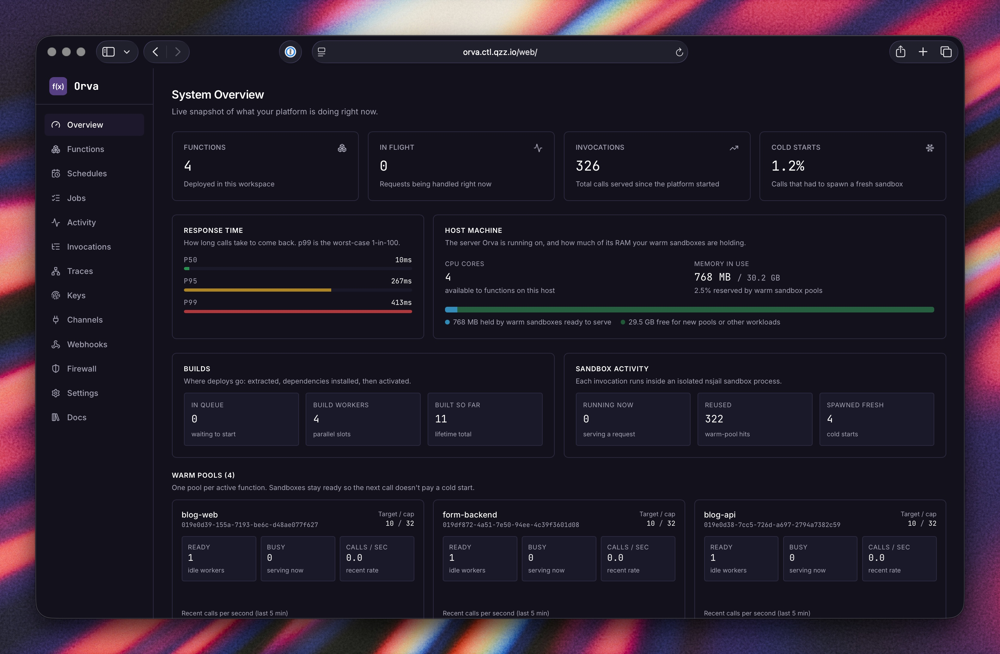
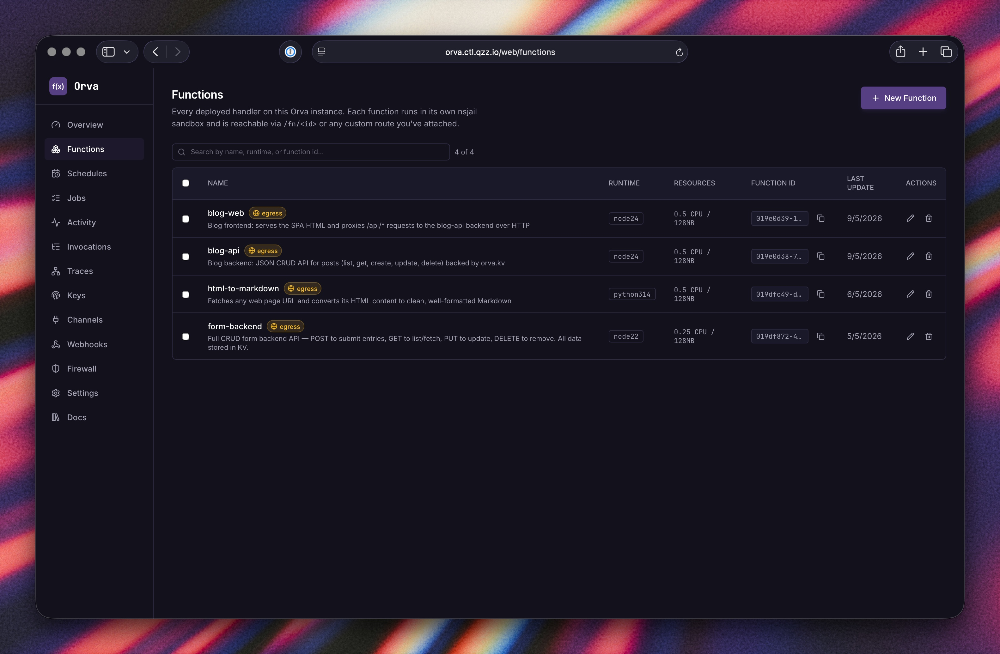
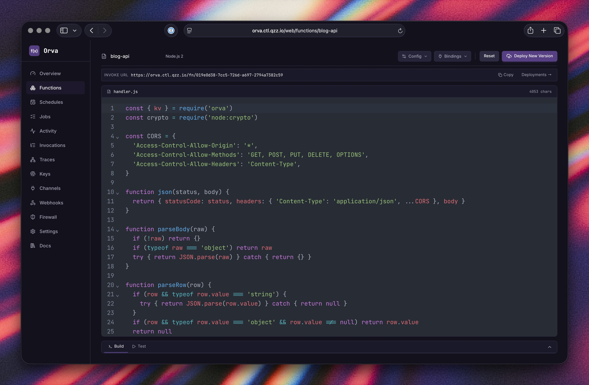
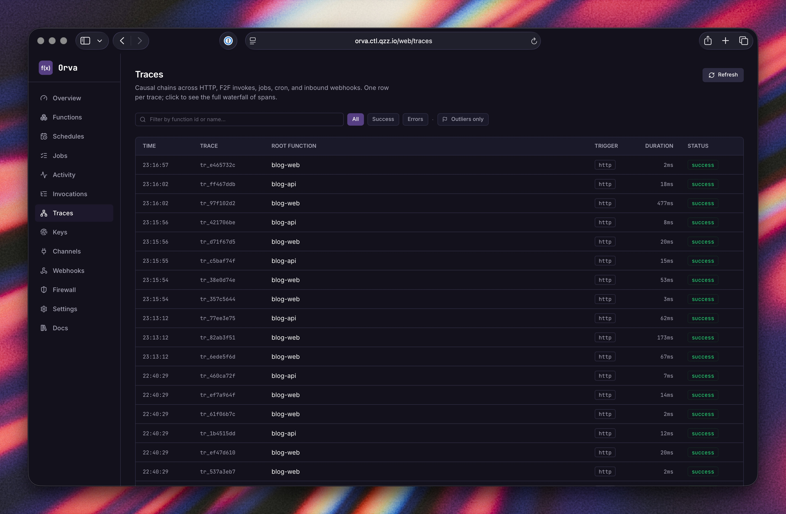
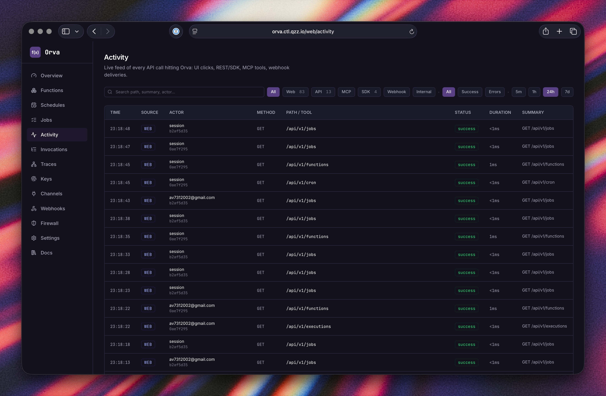
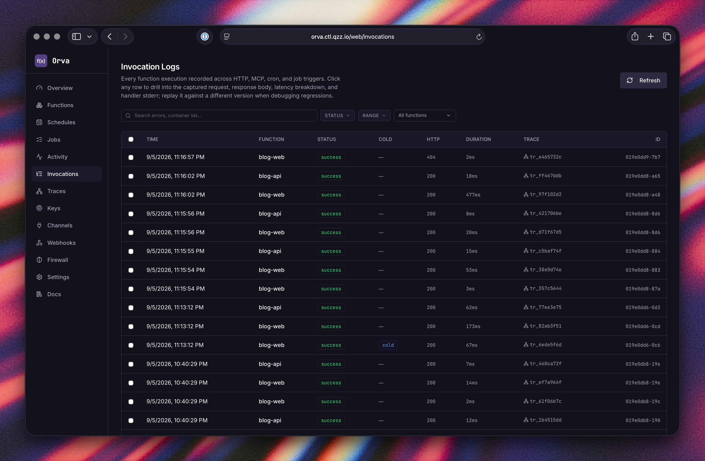
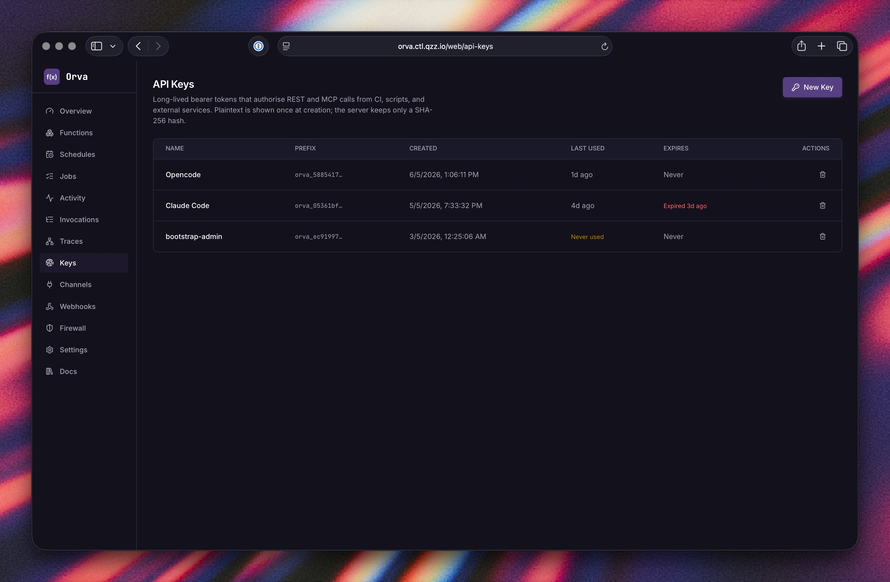
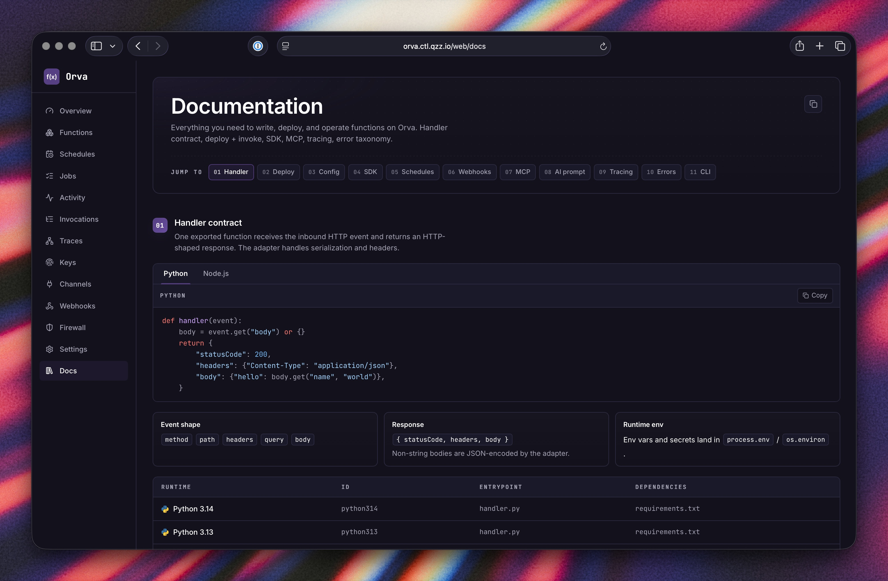
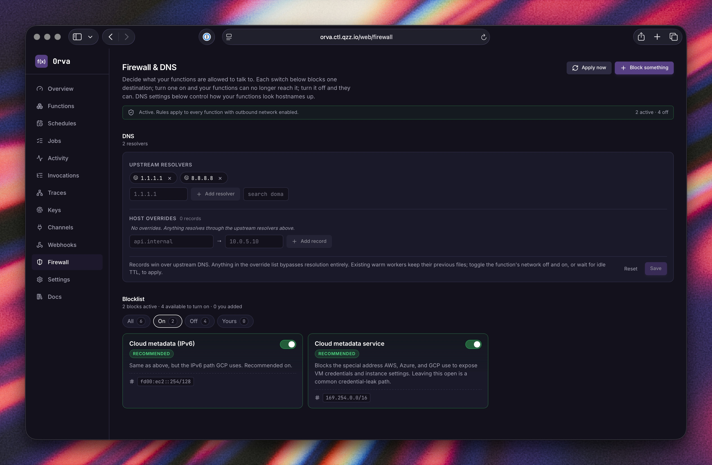
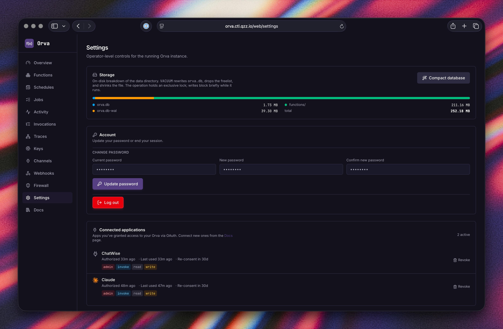

# Orva

[](https://github.com/Harsh-2002/Orva/releases/latest)
[](https://github.com/Harsh-2002/Orva/pkgs/container/orva)
[](LICENSE)
[](https://go.dev)
[](https://nodejs.org)
[](https://python.org)
[](docs/SUPPORT.md)

**Self-hosted Functions-as-a-Service for your homelab or on-prem server.**

Write a JavaScript or Python function, hit deploy — Orva runs it in an
isolated nsjail sandbox and exposes it over HTTP. Everything runs on hardware
you already own: no cloud account, no per-invocation billing, no external
services required.

Orva is not trying to replace AWS Lambda, Cloudflare Workers, or any
managed FaaS platform. It's for people who want that kind of workflow — write
a function, invoke it over HTTP, schedule it, chain it with other functions —
on a server they control. A Raspberry Pi, a homelab box, a VPS, or a bare-metal
machine. One Docker container, persistent SQLite storage, and a built-in
dashboard is all it takes.

> **Active development.** Stable enough for homelabs, side-projects, and
> internal tools. Not recommended for customer-facing production yet.

---

## One-command install

```bash
docker run -d --name orva \
  -p 8443:8443 \
  --cap-add SYS_ADMIN \
  --security-opt seccomp=unconfined \
  --security-opt apparmor=unconfined \
  --security-opt systempaths=unconfined \
  -v orva-data:/var/lib/orva \
  ghcr.io/harsh-2002/orva:latest
```

Then open **http://localhost:8443**, complete onboarding (takes ~30 seconds),
and you have a fully operational FaaS platform.

**docker-compose** (recommended for persistent setups):

```bash
curl -fsSL https://raw.githubusercontent.com/Harsh-2002/Orva/main/docker-compose.yml -o docker-compose.yml
docker compose up -d
```

---

## Install just the CLI

If you only need to talk to a remote Orva server (operator laptop, CI
runner, etc.), grab the ~12 MB standalone CLI. No Docker required, no
server install. Ships for Linux + macOS + Windows × amd64 + arm64.

**Linux + macOS:**

```bash
curl -fsSL https://github.com/Harsh-2002/Orva/releases/latest/download/install-cli.sh | sh
```

**Windows (PowerShell):**

```powershell
irm https://github.com/Harsh-2002/Orva/releases/latest/download/install-cli.ps1 | iex
```

Then:

```bash
orva login --endpoint https://your-orva.example.com --api-key orva_...
orva functions list
orva upgrade            # in-place self-update from GitHub
```

Full CLI docs at [docs/CLI.md](docs/CLI.md) — covers manual download,
shell autocompletion (bash / zsh / fish / powershell), first-run
security prompts, and `orva upgrade` mechanics.

---

## Screenshots

### System Overview — live metrics, warm pools, response-time percentiles


### Functions — every deployed handler, runtime, resources, last deploy date


### Editor — write and deploy code directly in the browser, with build logs and test pane


### Traces — automatic causal waterfall across HTTP → F2F invokes → background jobs


### Activity — live feed of every API call, CLI command, MCP tool, and webhook delivery


### Invocation Logs — every execution captured with request, response, duration, trace link


### API Keys — long-lived bearer tokens for CI, scripts, and AI agents


### Built-in Docs — full reference always available at `/web/docs`, no tab-switching


### Firewall & DNS — per-function egress rules, custom resolvers, blocklist


### Settings — storage, account, and OAuth-connected apps


---

## What you get

| Feature | Detail |
|---|---|
| **Runtimes** | Node.js 22, Node.js 24, Python 3.13, Python 3.14, TypeScript (via Node) |
| **Isolation** | Every invocation runs in a fresh nsjail sandbox — user namespace, chroot, cgroup v2, seccomp filter |
| **Warm pools** | One pool per function; idle workers stay resident between calls so repeated invocations skip the spawn cost entirely. Pool size is configurable per function. |
| **KV store** | Per-function key-value storage backed by SQLite. Use it as a cache, a counter, a session store, or lightweight persistent state. `kv.put / kv.get / kv.delete / kv.list` with optional TTL. Browsable and editable from the dashboard. |
| **Background jobs** | `jobs.enqueue(name, payload)` — persisted queue with configurable retries and exponential backoff. Visible in the dashboard with retry/cancel. |
| **Cron schedules** | Fire any function on a cron expression. Dashboard shows last run, next run, and status. |
| **Function-to-function** | `invoke('name', payload)` calls another function via the warm pool — no extra HTTP roundtrip, and the call becomes a child span in the same trace. |
| **Distributed tracing** | Every invocation chain is recorded automatically. HTTP → F2F calls → background jobs all share one `trace_id`. Waterfall view in the dashboard; zero code changes needed. |
| **Custom routes** | Map a path like `/webhooks/stripe` to a function so external callers use a clean URL instead of a function UUID. |
| **Secrets** | Per-function encrypted secrets, injected as env vars at sandbox spawn time. Never logged or stored in plaintext. |
| **Inbound webhooks** | Signed inbound trigger endpoints (GitHub, Stripe, Slack, generic HMAC) that fan into a function. |
| **Rollback** | Every deploy is content-hashed and archived. Roll back to any prior version in one click or one CLI command. |
| **MCP server** | 70 tools at `/mcp` — any MCP client (Claude Code, Cursor, etc.) can create functions, deploy code, manage secrets, browse KV, and read logs. |
| **OAuth 2.1** | Add Orva as a custom connector in claude.ai or other OAuth-capable MCP clients — no API key copy-paste needed. |
| **16 templates** | Stripe webhooks, GitHub events, JWT auth, OAuth, CSV→JSON, URL shortener, and more — pickable in the editor. |

---

## SDK (inside a function)

No HTTP client setup needed. The `orva` module is pre-installed in every sandbox.

```js
// Node.js
const { kv, invoke, jobs } = require('orva')

exports.handler = async (event) => {
  // KV store
  await kv.put('counter', (await kv.get('counter') || 0) + 1)

  // Call another function — becomes a child span in the same trace
  const result = await invoke('send-notification', { msg: 'hello' })

  // Background job — runs async, retries on failure
  await jobs.enqueue('audit-log', { action: 'ping', at: Date.now() })

  return { statusCode: 200, body: { ok: true } }
}
```

```python
# Python
from orva import kv, invoke, jobs

def handler(event):
    kv.put("counter", (kv.get("counter") or 0) + 1)
    result = invoke("send-notification", {"msg": "hello"})
    jobs.enqueue("audit-log", {"action": "ping"})
    return {"statusCode": 200, "body": {"ok": True}}
```

---

## Architecture & isolation

### How a function runs

```
  HTTP request
       │
       ▼
  ┌─────────────────────────────────┐
  │  Orva server (Go)               │
  │  auth → route → warm pool       │
  └────────────┬────────────────────┘
               │  worker available?
       ┌───────┴────────┐
       │ yes (warm)     │ no (cold start)
       │                ▼
       │    ┌──────────────────────┐
       │    │  Build queue         │
       │    │  npm install /       │
       │    │  pip install         │
       │    └──────────┬───────────┘
       │               │
       ▼               ▼
  ┌──────────────────────────────────────┐
  │  nsjail sandbox process              │
  │                                      │
  │   adapter.js / adapter.py            │
  │      └── your handler code           │
  │                                      │
  │   orva SDK (kv / invoke / jobs)      │
  │      └── loopback only → Orva API    │
  └──────────────────────────────────────┘
       │
       ▼
  HTTP response (streamed back)
```

Warm workers stay alive between calls so back-to-back invocations skip the cold start entirely. Each function gets its own pool; pool size is configurable per function.

### Isolation layers

Orva uses **nsjail** — a battle-tested sandboxer from Google — to wrap every function process in five overlapping Linux kernel boundaries:

```
  Docker container  (SYS_ADMIN granted so nsjail can set up namespaces)
  └── nsjail
        ├── 1. User namespace
        │      UID 0 inside → nobody (65534) on host
        │      All 64 Linux capability bits cleared (verified in /proc/self/status)
        │
        ├── 2. Mount namespace + chroot
        │      /code  → function's versioned directory (read-only bind mount)
        │      /tmp   → private tmpfs (wiped after each invocation)
        │      Nothing else is visible — no /proc of the host, no other functions
        │
        ├── 3. cgroup v2
        │      memory.max   per-function memory ceiling
        │      cpu.max      CPU quota (configurable)
        │      pids.max     hard fork-bomb limit
        │      Host refuses new spawns past 80% total reservation
        │
        ├── 4. Seccomp (Kafel policy)
        │      ~150 syscalls blocked: mount, unshare, bpf,
        │      kexec_load, init_module, ptrace, and more
        │      Attempts log + kill the process, never silently fail
        │
        └── 5. Network namespace
               network_mode: none  →  loopback only (default)
               network_mode: egress →  outbound HTTPS via nftables allowlist
               Inbound connections to the function are not possible either way
```

### How it compares

| | Orva (nsjail) | Firecracker / VMs | Plain Docker |
|---|---|---|---|
| **Kernel** | Shared with host | Separate kernel per VM | Shared with host |
| **Isolation primitive** | Linux namespaces + seccomp + cgroup v2 | Hardware virtualisation (KVM) | Linux namespaces + cgroup |
| **Syscall surface** | ~150 syscalls blocked via Kafel policy | Near-zero (hardware VM boundary) | Unfiltered by default |
| **Capability drop** | All 64 Linux caps cleared | N/A (separate kernel) | Partial (Docker defaults) |
| **Cold start** | ~50–200 ms (process spawn) | ~125 ms (Firecracker MicroVM) | N/A |
| **Memory per worker** | ~30 MB | ~5 MB per MicroVM | Varies |
| **Good for** | Homelabs, internal tools, trusted code | Multi-tenant cloud, untrusted third-party code | General app containers |

Orva's model sits between plain Docker and a full VM: the host kernel is shared, but each function runs in a heavily restricted process with no capabilities, a read-only filesystem view, hard resource ceilings, and a strict syscall allowlist. For homelab and internal use it's a solid baseline.

**Note on Kata Containers (`--runtime=kata`)** — verified end-to-end on 2026-05-13 with Kata 3.30.0. Both hypervisors tested (QEMU + Cloud Hypervisor) work cleanly: container starts, function deploys, invokes succeed including outbound HTTPS from the sandbox. Kata puts a real Linux kernel under the entire orvad container, so nsjail's per-function namespace setup keeps working unchanged. This is the right choice when you want hypervisor-class isolation around Orva. Full operator guide + measured perf cost: [`docs/KATA.md`](docs/KATA.md).

**Note on gVisor (`runsc`)** — end-to-end testing on 2026-05-13 (gVisor `release-20260504.0`, both `ptrace` and `kvm` platforms) found that **Orva does not run under gVisor**. The Orva daemon starts and the HTTP API is reachable, but function invocation fails: nsjail's per-function sandbox setup needs `clone(CLONE_NEWNS|CLONE_NEWUSER|CLONE_NEWPID|CLONE_NEWNET|…)` which gVisor's user-space kernel rejects with `EINVAL`. This is a fundamental incompatibility between nsjail's design and gVisor's nested-namespace support, not a bug in either project — gVisor explicitly declines to expose the host's namespace primitives, and nsjail can't run without them. Full writeup: [`docs/GVISOR.md`](docs/GVISOR.md).

Full threat model: [`docs/SECURITY.md`](docs/SECURITY.md)

---

## AI agent integration (MCP)

Orva ships a full **Model Context Protocol** server. Add it to any MCP client with one URL:

```
https://your-orva-instance/mcp
```

From there an AI agent can create functions, deploy code, invoke them, read logs, manage secrets,
browse KV state, and pull the full Orva reference docs — all without leaving the chat. Works
with Claude Code, Cursor, and any OAuth-capable MCP client like the claude.ai web UI.

---

## CLI

The same binary powers both server and CLI.

```bash
# Install (Linux)
curl -fsSL https://github.com/Harsh-2002/Orva/releases/latest/download/orva-cli-linux-amd64 \
  -o /usr/local/bin/orva && chmod +x /usr/local/bin/orva

orva login --endpoint https://orva.example.com --api-key <key>
orva functions list
orva deploy my-fn ./src
orva invoke my-fn --body '{"name":"world"}'
orva logs my-fn --follow
```

Binaries: `linux-amd64`, `linux-arm64`, `darwin-arm64`. Fully static, no runtime deps.

---

## Configuration

All settings are optional — defaults work out of the box.

| Variable | Default | Description |
|---|---|---|
| `ORVA_PORT` | `8443` | HTTP listen port |
| `ORVA_DATA_DIR` | `/var/lib/orva` | SQLite DB, function code, rootfs |
| `ORVA_DEFAULT_MEMORY_MB` | `64` | Memory ceiling for new functions |
| `ORVA_DEFAULT_TIMEOUT_MS` | `30000` | Execution timeout for new functions |
| `ORVA_LOG_RETENTION_DAYS` | `7` | Days of execution logs to keep |
| `ORVA_SESSION_DAYS` | `7` | Session cookie lifetime |
| `ORVA_SECURE_COOKIES` | _false_ | Set `true` when behind HTTPS |
| `ORVA_WRITE_TIMEOUT_SEC` | `60` | HTTP write timeout (set ≥ function timeout) |

Full reference: [`docs/CONFIG.md`](docs/CONFIG.md)

---

## Build from source

```bash
git clone https://github.com/Harsh-2002/Orva.git && cd Orva
make dev          # hot-reload frontend :5173 + backend :8443
make build-all    # production binary → ./build/orva
make test         # go test ./...
```

Requires Go 1.25+, Node 22+, and nsjail on Linux for sandbox invocations.

---

## Documentation

| | |
|---|---|
| [`docs/ARCHITECTURE.md`](docs/ARCHITECTURE.md) | System design, request + deploy lifecycle |
| [`docs/SECURITY.md`](docs/SECURITY.md) | Threat model, sandbox isolation, verification recipe |
| [`docs/RUNTIMES.md`](docs/RUNTIMES.md) | Handler contract, event shape, streaming |
| [`docs/API.md`](docs/API.md) | Full REST API reference |
| [`docs/CONFIG.md`](docs/CONFIG.md) | All config knobs |
| [`docs/DEPLOYMENT.md`](docs/DEPLOYMENT.md) | TLS, reverse proxy, backups, upgrades |
| [`docs/OPERATIONS.md`](docs/OPERATIONS.md) | Monitoring, troubleshooting, common errors |
| [`docs/CAPACITY.md`](docs/CAPACITY.md) | Throughput numbers + benchmark methodology |

---

## License

Apache-2.0
