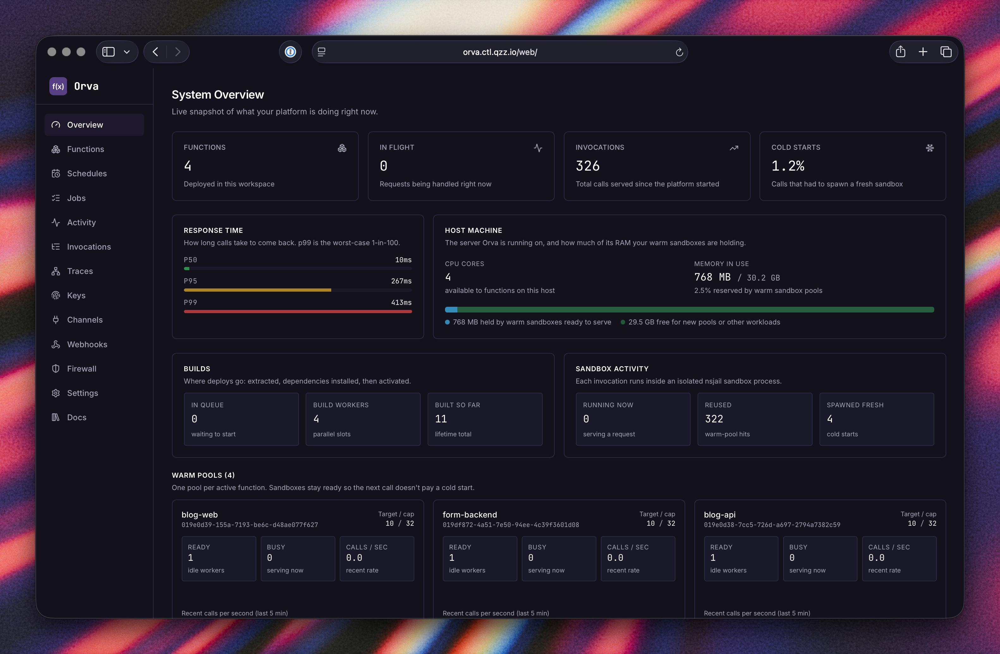
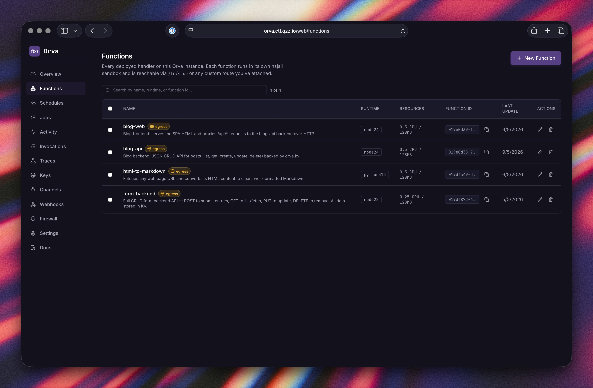
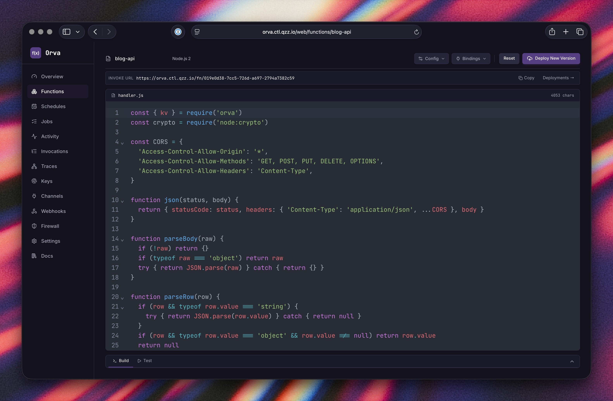
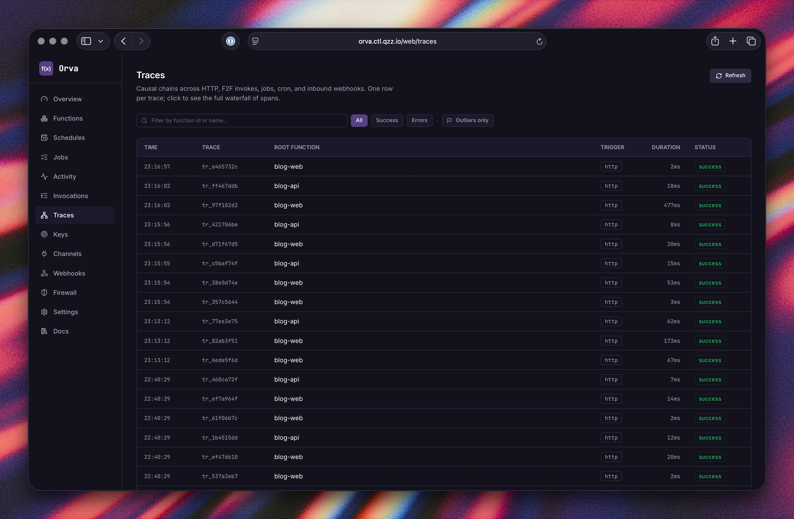
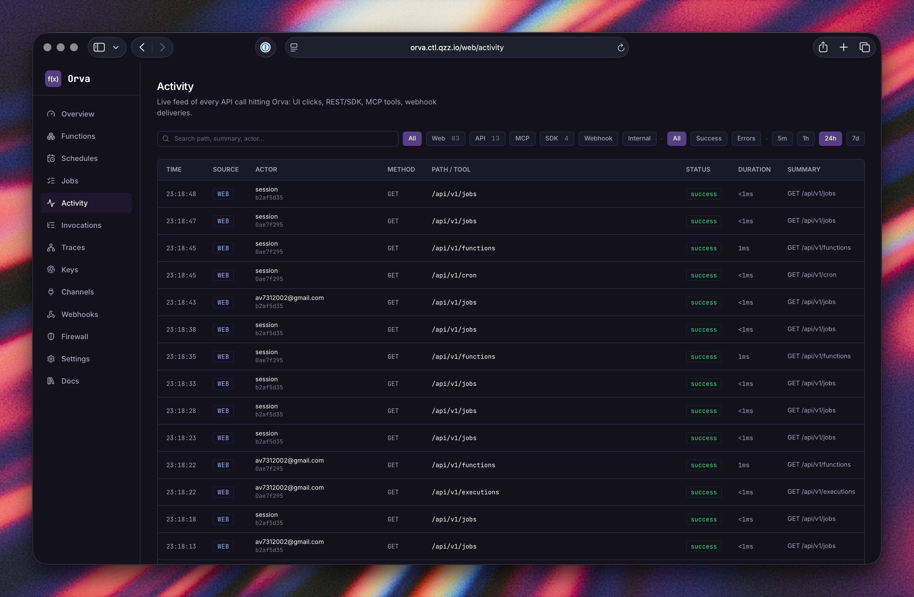
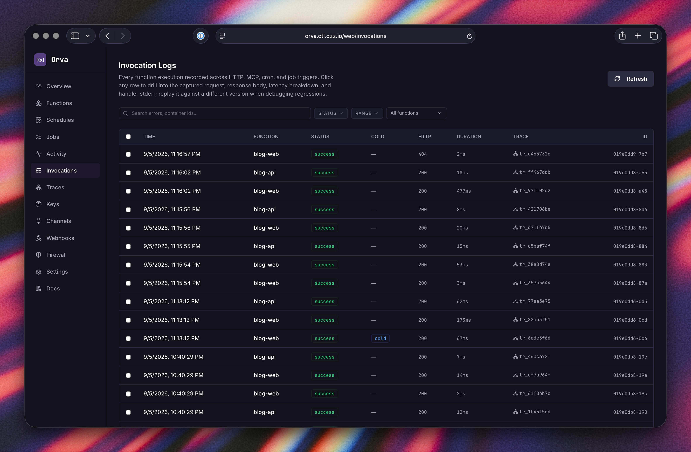
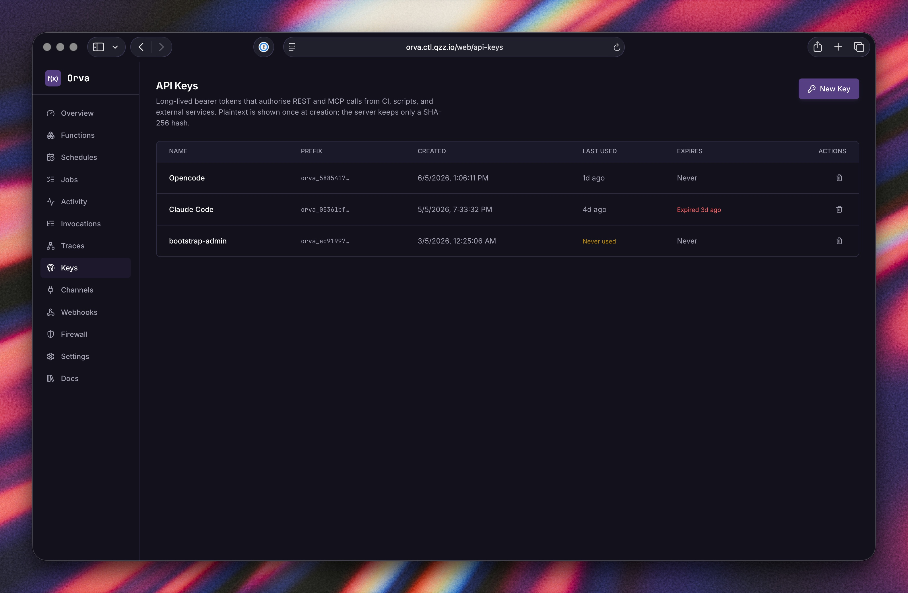
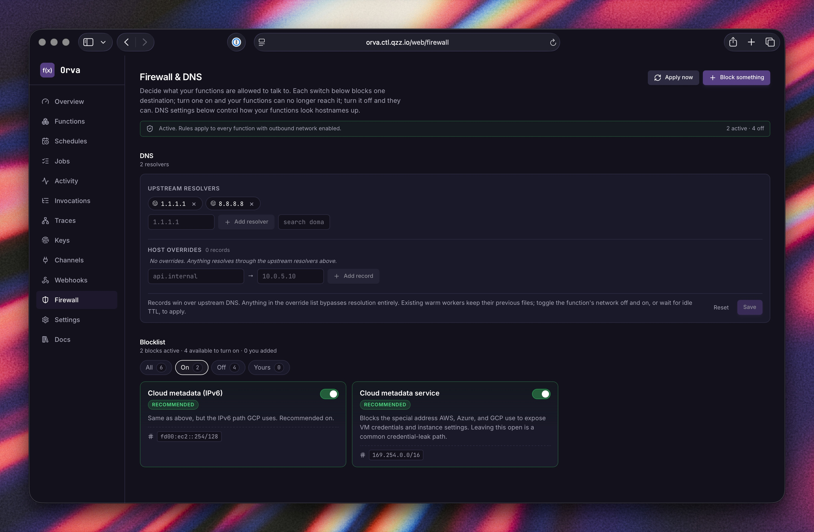
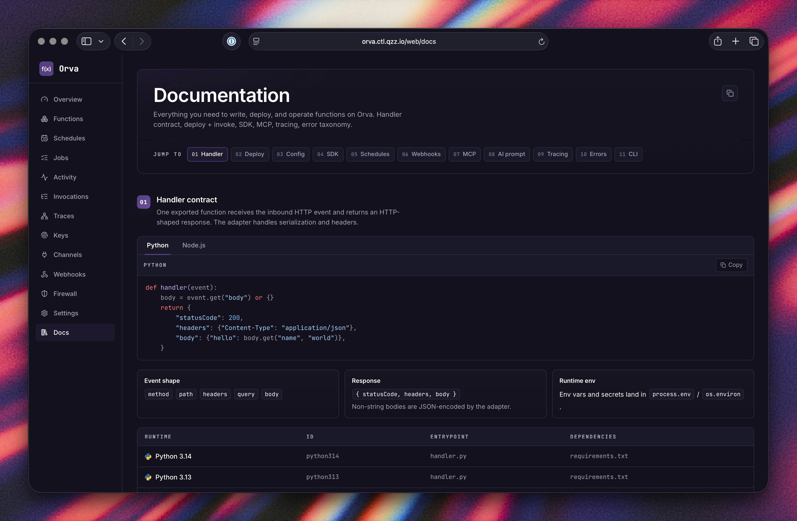
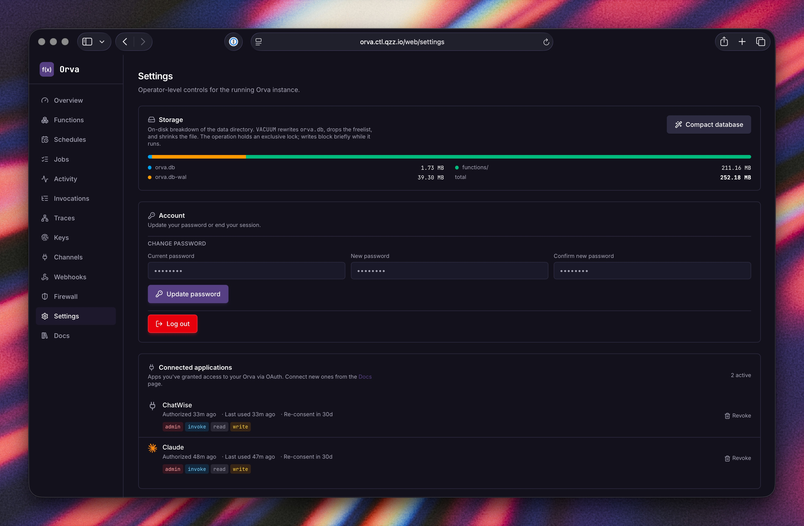

# Orva

[](https://github.com/Harsh-2002/Orva/releases/latest)
[](https://github.com/Harsh-2002/Orva/pkgs/container/orva)
[](LICENSE)
[](https://go.dev)
[](https://nodejs.org)
[](https://python.org)

**Self-hosted Functions-as-a-Service for your homelab or on-prem server.**

Write a JavaScript, TypeScript, or Python function, hit deploy — Orva runs it in an
isolated nsjail sandbox and serves it over HTTP. One Docker container gives you the
runtime, a dashboard, a CLI, an MCP server, and a built-in AI assistant. It's for the
Lambda/Workers workflow — write a function, invoke it over HTTP, schedule it, chain it —
on hardware you control (a Pi, a homelab box, a VPS, bare metal). No cloud account, no
per-invocation billing.

> **Active development.** Solid for homelabs, side-projects, and internal tools.
> Not recommended for customer-facing production yet.

---

## Quick start

```bash
docker run -d --name orva -p 8443:8443 \
  --cap-add SYS_ADMIN \
  --security-opt seccomp=unconfined \
  --security-opt apparmor=unconfined \
  --security-opt systempaths=unconfined \
  -v orva-data:/var/lib/orva \
  ghcr.io/harsh-2002/orva:latest
```

Open **http://localhost:8443**, finish onboarding (~30s), and deploy your first
function from the in-browser editor.

Prefer Compose, a bare-metal service, or just the CLI? See **[Install](#install)**.

---

## Screenshots

| | |
|---|---|
| **System overview** — live metrics, warm pools, latency percentiles | **Functions** — runtime, resources, last deploy |
|  |  |
| **Editor** — write, build, and test in the browser | **Traces** — causal waterfall across HTTP → F2F → jobs |
|  |  |
| **Activity** — live feed of API, CLI, MCP, and webhook events | **Invocation logs** — request, response, duration, trace link |
|  |  |
| **API keys** — bearer tokens for CI, scripts, and agents | **Firewall & DNS** — per-function egress rules |
|  |  |
| **Built-in docs** — full reference at `/web/docs` | **Settings** — storage, OAuth apps, build info |
|  |  |

---

## Features

- **Two runtimes** — `node` (Node.js 24, also runs TypeScript) and `python` (Python 3.14).
- **Real isolation** — every call runs in a fresh nsjail sandbox: user namespace, chroot, cgroup v2 limits, and a seccomp syscall allowlist. → [Security](docs/SECURITY.md)
- **Warm pools** — idle workers stay resident per function, so repeat calls skip cold start.
- **Built-in primitives** — per-function KV store, background jobs (retries + backoff), cron schedules, function-to-function calls, encrypted secrets, custom routes, and signed inbound webhooks.
- **Distributed tracing** — every HTTP → F2F → job chain shares one trace, with a waterfall view and zero code changes.
- **Versioning** — content-hashed deploys with one-click (or one-command) rollback and side-by-side diffs.
- **MCP + AI** — a 70-tool MCP server at `/mcp` and a built-in agentic AI assistant (dashboard or `orva chat`) that operate your instance with your own provider key. → [AI & MCP](#ai--mcp)
- **Templates** — 16 starters (Stripe/GitHub webhooks, JWT/OAuth, CSV→JSON, URL shortener, …) in the editor.

---

## Write a function

The `orva` SDK is preinstalled in every sandbox — KV, function-to-function invoke, and
background jobs with no setup:

```js
// Node — Python uses the same shape: from orva import kv, invoke, jobs
const { kv, invoke, jobs } = require('orva')

exports.handler = async (event) => {
  await kv.put('hits', (await kv.get('hits') || 0) + 1)
  await invoke('send-notification', { msg: 'hello' })   // child span in the same trace
  await jobs.enqueue('audit-log', { at: Date.now() })   // async, retried on failure
  return { statusCode: 200, body: { ok: true } }
}
```

Handler contract, event shape, and streaming: [docs/RUNTIMES.md](docs/RUNTIMES.md).

---

## Install

**Docker Compose** (recommended for persistent setups):

```bash
curl -fsSL https://raw.githubusercontent.com/Harsh-2002/Orva/main/docker-compose.yml -o docker-compose.yml
docker compose up -d
```

**Bare-metal / VM** — systemd or OpenRC, no Docker (Debian/Ubuntu, Fedora/RHEL/Rocky/Alma, Alpine, Arch, openSUSE):

```bash
curl -fsSL https://github.com/Harsh-2002/Orva/releases/latest/download/install.sh | sh
```

**CLI only** — operator laptop or CI runner (Linux, macOS, Windows × amd64/arm64):

```bash
curl -fsSL https://github.com/Harsh-2002/Orva/releases/latest/download/install-cli.sh | sh   # macOS / Linux
irm  https://github.com/Harsh-2002/Orva/releases/latest/download/install-cli.ps1 | iex        # Windows
```

Installers are idempotent — re-run to upgrade; pin a version with `ORVA_VERSION=vYYYY.MM.DD`.
TLS, reverse proxy, and backup guidance: [docs/DEPLOYMENT.md](docs/DEPLOYMENT.md).

---

## CLI

The same binary is server **and** client. After `orva login`, the whole platform is in your terminal:

```bash
orva deploy ./src --name my-fn --runtime node   # runtimes: node | python
orva invoke my-fn --body '{"name":"world"}'
orva logs my-fn --follow
orva chat                                        # the AI assistant, in your terminal
```

Output is scripting-clean (`-o json`; data on stdout, status on stderr). Full reference: [docs/CLI.md](docs/CLI.md).

---

## AI & MCP

Add Orva to any MCP client (Claude Code, Cursor, or claude.ai via OAuth) with one URL:

```
https://your-orva-instance/mcp
```

The agent can create and deploy functions, invoke them, read logs, manage secrets, and browse KV.
Prefer not to wire up an external client? The dashboard's **AI** section — and `orva chat` — run
the same agent in-product with your own provider key (OpenAI, Anthropic, or any OpenAI-compatible
endpoint) and optional per-write approval.

---

## Configuration

Defaults work out of the box. Common knobs: `ORVA_PORT` (8443), `ORVA_DATA_DIR`
(`/var/lib/orva`), `ORVA_SECURE_COOKIES` (set `true` behind HTTPS). Full reference:
[docs/CONFIG.md](docs/CONFIG.md).

---

## Documentation

| | |
|---|---|
| [ARCHITECTURE](docs/ARCHITECTURE.md) | System design, request + deploy lifecycle |
| [SECURITY](docs/SECURITY.md) | Threat model, sandbox isolation, verification recipe |
| [RUNTIMES](docs/RUNTIMES.md) | Handler contract, event shape, streaming |
| [API](docs/API.md) | Full REST API reference |
| [CLI](docs/CLI.md) | Config precedence, command reference, workflows |
| [CONFIG](docs/CONFIG.md) | All configuration knobs |
| [DEPLOYMENT](docs/DEPLOYMENT.md) | TLS, reverse proxy, backups, upgrades |
| [OPERATIONS](docs/OPERATIONS.md) | Monitoring, troubleshooting, common errors |
| [SUPPORT](docs/SUPPORT.md) | Distro / kernel / container-runtime matrix |
| [CAPACITY](docs/CAPACITY.md) | Throughput numbers + benchmark methodology |
| [CONTRIBUTING](docs/CONTRIBUTING.md) | Dev setup, build from source, tests |

Runtime isolation specifics (Kata, gVisor) live in [docs/KATA.md](docs/KATA.md) and [docs/GVISOR.md](docs/GVISOR.md).

---

## License

Apache-2.0
